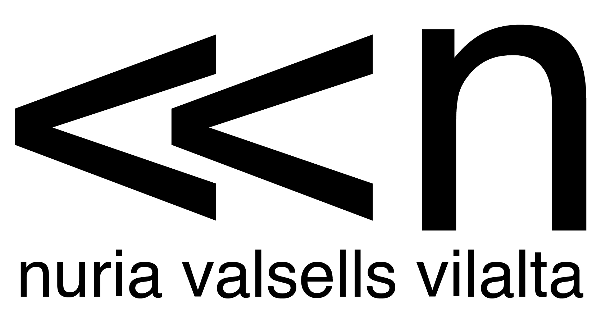

# Get to know me
Hello, my name is Núria Valsells Vilalta, and I’m excited to introduce you to my MDEF documenation page. 

{: style="height: auto; width: 400px; margin-left: 120px"}
 
 I’m a 24-year-old from Barcelona who graduated with a Bachelor’s degree in Industrial Design and Product Development Engineering from the Universitat Politècnica de Catalunya. After graduation, I began working at Azimut 360, a non-profit cooperative dedicated to the engineering and installation of photovoltaic systems, both nationally and internationally. However, I soon realized that my interests extended far beyond designing everyday objects and products in a more elegant, aesthetic way. I wanted to use my skills to make a positive impact on society.

That’s why I pursued a Master’s degree in Social Design. Through my studies, I have expanded my knowledge and vision of industrial design as a tool for transforming everything that is already established. From industrial and manufacturing processes to the most everyday objects that perpetuate attitudes in society that need to change in order
to move forward.

I spent 1 year taking a Master in Social Design at NABA (Nuova Accademia di Belle Arti) in Milan, Italy. It was a very interesting year, I learned a lot from my teachers and collegues and I got to participate in meaningful projects that motivated me a lot. When I started, this last September, the second course of the Master, I realized that the second year wasn't gonna fufill my expectations and the experience wasn't motivating enough for me. The 15th of October I made the decision to move back to Barcelona and start the Master in Design for Emergent Futures.

So far, I'm very happy with my decision and I think it will bring me a lot of positive things, while living again in my beloved Barcelona <3.

{: style="height: auto; width: 100px; margin-left: 600px"}