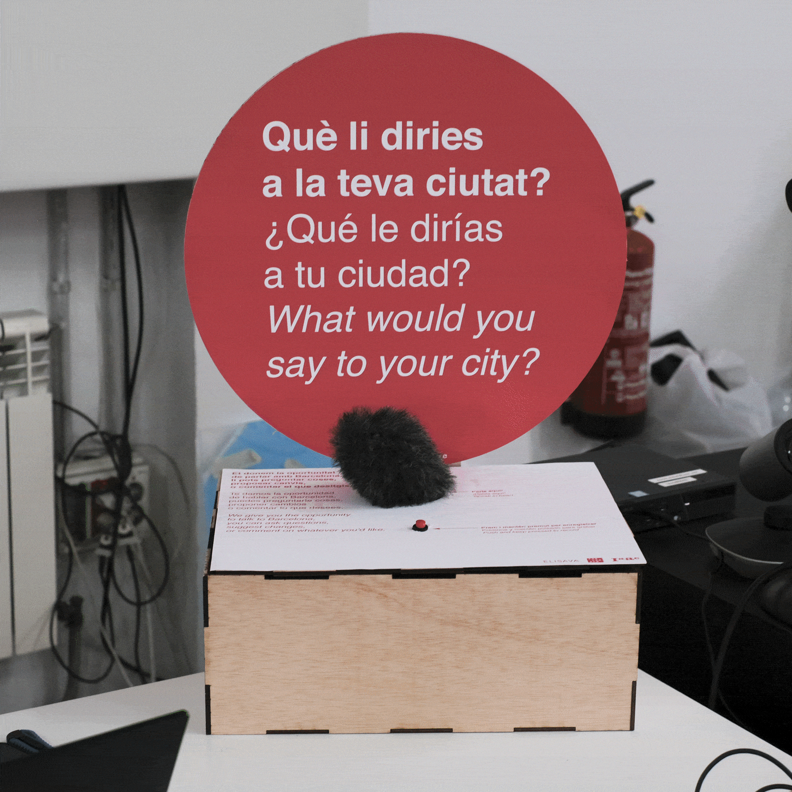
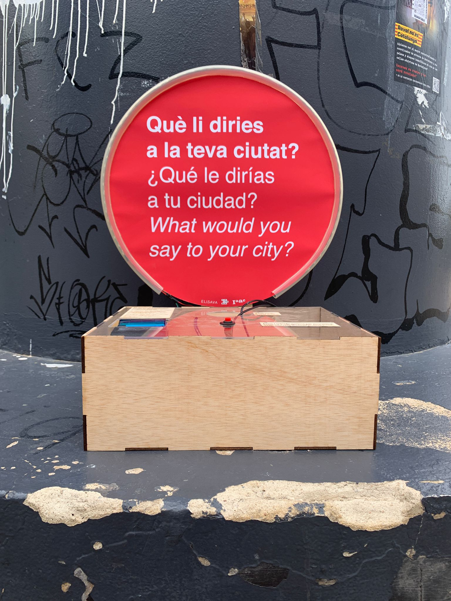

# .png){width=70}

The development of the Laia project began with the creation of a machine that could pose a question: **"What would you say to your city?"** Users could record their answers in audio format, and the machine would store these audio files. It functioned almost like a confessional, offering a **speculative** way for people to express their thoughts. You can find all the documentation for the first prototype in the [MicroChallenge I](http://127.0.0.1:8000/test/term2/MicroChallenge/) page.

As the prototype evolved, we incorporated **OpenAI technology** into the machine through API calls. This enabled us to transcribe the user's audio responses, send them to ChatGPT, and **play back an audio response**. While this made the machine more "useful," the generated answers from OpenAI were not sufficiently interesting. They tended to be **standard and corporate, lacking real engagement** with the user. You can find all the documentation for the second prototype in the [MicroChallenge II](http://127.0.0.1:8000/test/term2/MicroChallenge/) page.

To address this issue, we began researching **what voice Barcelona would have**. However, this question proved challenging to answer due to the city's vast scale. To simplify our approach, we decided to focus on a specific neighborhood and community. We reached out to **Akasha Hub**, a community of designers and makers in **El Clot, Barcelona**. They provided us with community references and other relevant information, becoming our first **collaborators**.

With a focus on El Clot established, we familiarized ourselves with the area and began making contacts with associations recommended by Akasha Hub. During this period, we concurrently worked on **both the community workshops and the technical aspects of the project**. We developed a third version of the machine, which we named Laia. In this version, we created an **online form accessible to anyone**, allowing residents of El Clot to "teach" Laia their knowledge. This ensured that when people from El Clot interacted with Laia, they would receive **answers that incorporated the collective knowledge** of their neighbors.

{ width="245" } { width="435" }

**Currently, we continue to conduct workshops with the community, learning from each interaction with Laia. These sessions have been invaluable for receiving genuine feedback from our target audience and shaping the future fourth version of Laia. Through ongoing engagement with the community, we aim to refine Laia further and enhance its effectiveness in serving the needs of the neighborhood.**