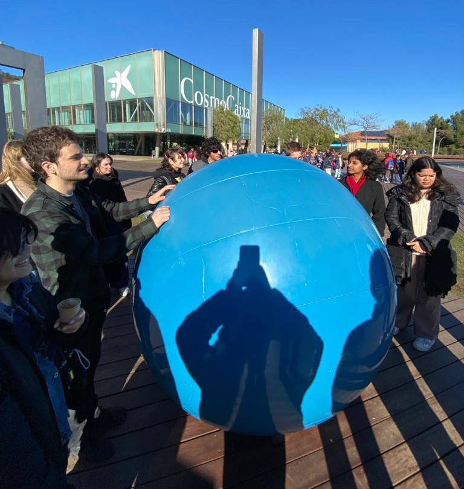
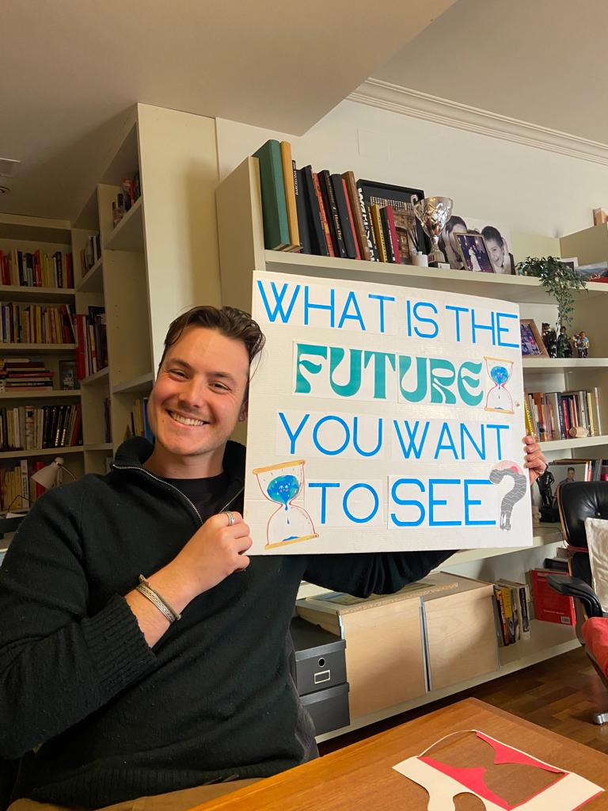
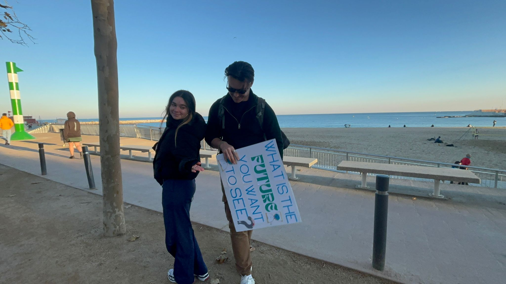
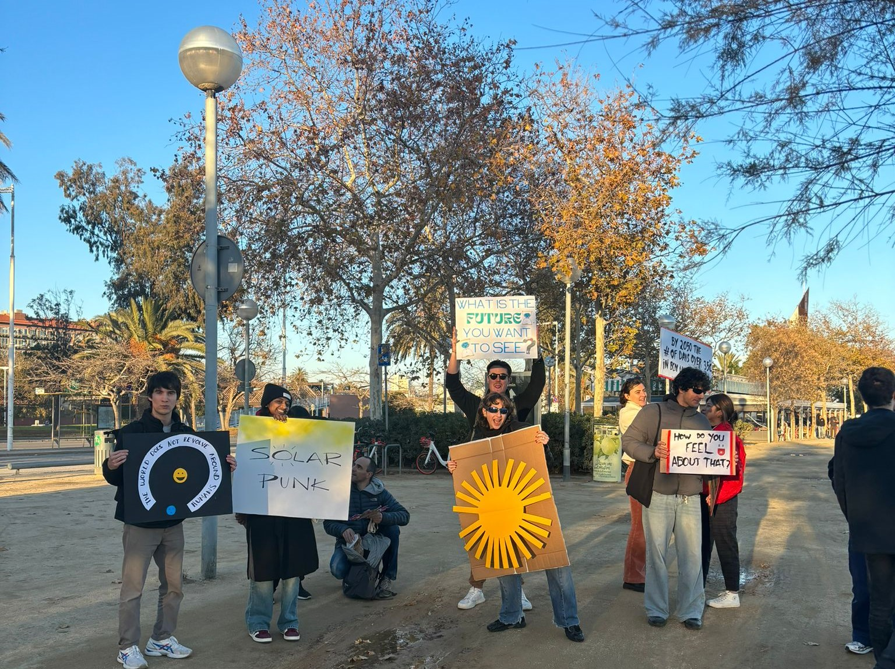

# **Design in a State of Climate Emergency**

> Andrés Colmenares

> 2-12 January 2024

---

## **Contents**

The seminar entitled "Addressing Challenges in Times of Climate Crisis," presented by Andrés Colmanares, explored the various challenges arising from the climate emergency and examined the crucial role of design in addressing them. During the presentation, Colmanares shared his personal and professional experiences, highlighting his experience as a Latin American migrant and his work in digital strategy and responsibility in artificial intelligence. Throughout the talk, concepts such as polycrisis, artificial intelligence and the influence of metaphors and words were addressed, highlighting the importance of adaptability, critical thinking and a deep understanding of interrelated global challenges.

The seminar was not presented as goal-directed, but based on intentions. It focused on intuition, the learning process, present experiences, long-term development and states of being, rather than on achieving concrete results or focusing on future outcomes. Andrés sought to help us broaden our perspective on design, especially in the context of polycrisis, and to align our learning with cultural, ecological and social transformations.

The importance of trust, respect, collaboration, inclusion, and active listening was emphasized from the outset. "Criticism is valued as long as it is constructive and avoids personal attacks." The course adopted a peer-to-peer (P2P) approach, prioritizing collaborative learning over the traditional teacher-student dynamic. Andrés encouraged us to consider each other as peers or participants in a collective learning experience.

The training put a lot of emphasis on giving relevance to the real-world context in which we live, including the current climate emergency and the various crises. We created a safe space to reimagine the world and acknowledge responsibility to those who were not present in the room.

{style: width="200", align=right} 

On Friday 12th, we undertook the final activity of the seminar, which was divided in two parts. The first part was positioned in CosmoCaixa, the Science Museum of Barcelona. There we found a sized earth globe in the sun, that served us as the main focus for the action we were going to make. Andres proposed us to listen to a text he would read while all of us walked around the "earth". The experience was very calming and like something we had never done in any seminar.

Unfortunately, I couldn't take part in the second part of the activity, since I was very sick. But I worked with my group to design a poster that would engage a conversation about the future of the planet regarding the climate emergency we've caused. Once we designed the poster, the rest of my group went to the Bogatell beach a spent some time talking to people of all ages and origins about the issue. I want to give a special thanks to my group members, Annna Oliver and Carmen <3.

{ width="350" } 

{ width="350" } 

{ width="350" }

---
## **Final Reflection**

Participating in this seminar was an enriching experience that awakened my interest in several aspects. The content presented by Andrés was fascinating, although I confess that I find it difficult to visualize how to apply it concretely to my projects and real life. However, I consider that this difficulty can also be an opportunity to explore new ways of integrating the learnt knowledge into my daily practice.

Andres proved to be an excellent teacher, standing out for his ability to convey complex concepts in an accessible way. His emphasis on values such as trust, respect and collaboration from the outset created an environment conducive to learning.

Regarding the final activity, although it was interesting, I would have liked to have had the opportunity to visit the Cosmo Caixa as well. Other than that, I was very sad that I could not participate in the beach activity and had to leave my group alone. Although it would have been an activity out of my comfort zone, I think it is positive to live these experiences.

The concept of polycrisis was totally new to me, and although it can be overwhelming to think about, I find it an essential concept to understand today's challenges. I would like to delve more deeply into this topic, exploring how I can apply this knowledge in a practical way and reflecting on its relevance in my daily life.

