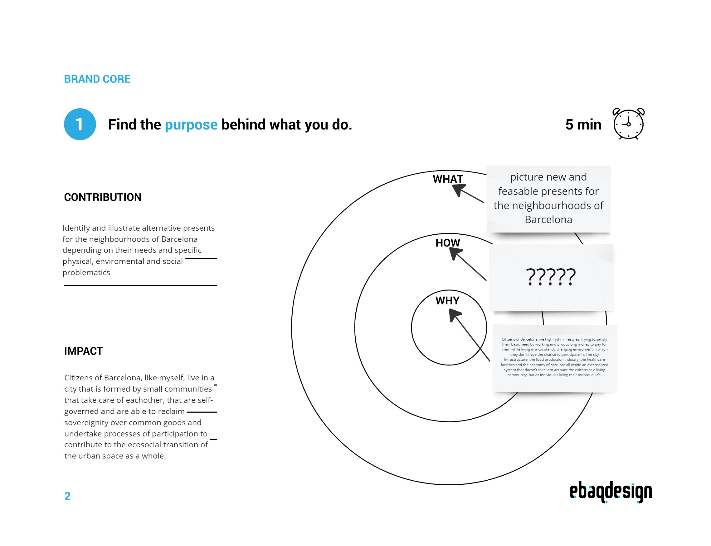
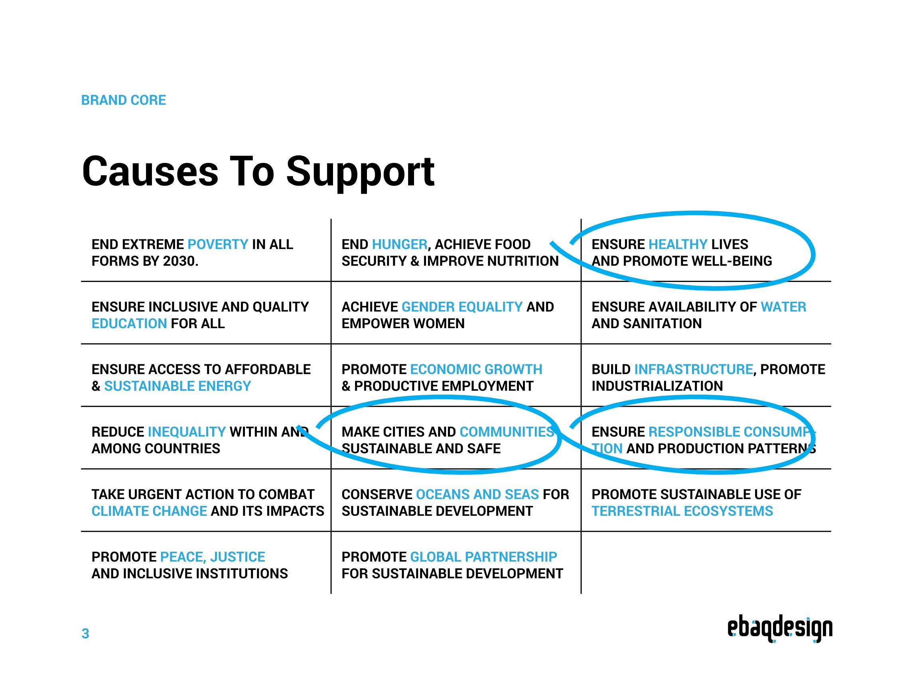
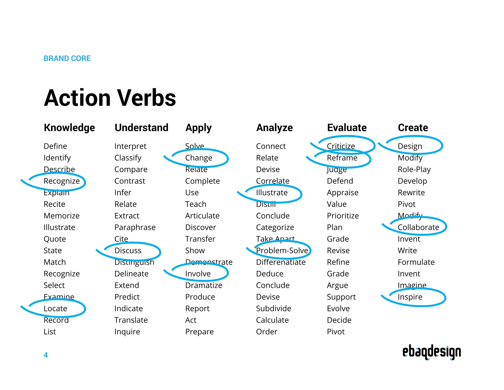
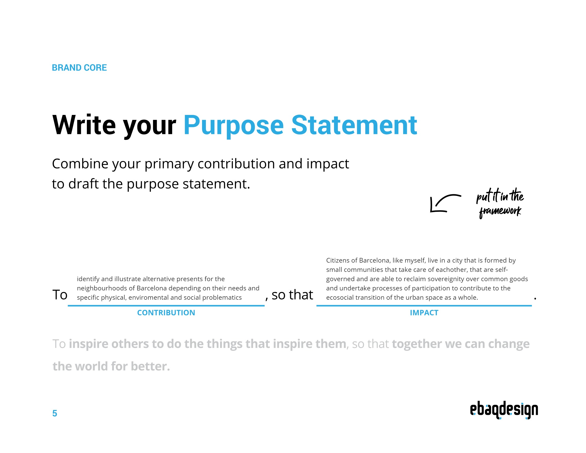
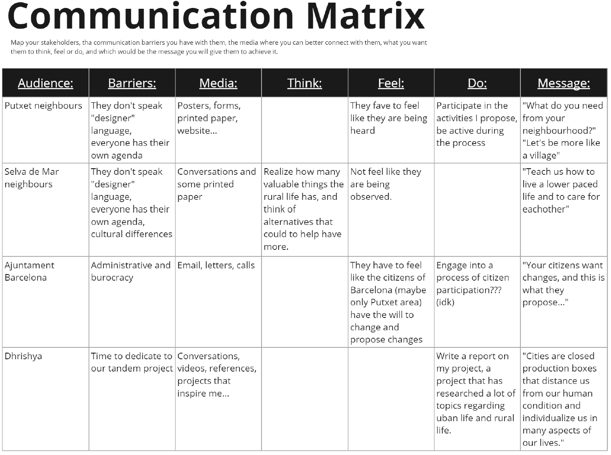

# **Communicating Ideas**

> Pablo Zuloaga Betancourt

> During second term

---

## Session 1 - 16th January

### Personal Project
Stakeholders communication radar:

### Tandem Project

> **Partner:** Dhrishya Ramadass

> **Questions:**

What about your personal background has triggered your interest in these topics?

How do you plan to involve yourself personally in the narrative of your project?

Have you set any boundaries within the topics you want to explore? Is there something you don't want to research about?

How do you think the fact that you are doing this research in a completely different cultural context affects the project itself?

> **Video/Document:**

During this week we had a lot of difficulties to film a video, so I decided to create a document with Dhrishya's answers and design it in a way that it would represent the talking emphasis she put during the conversation. I recommend reading the document while listening to Dhrishya's audio.

<iframe src="https://drive.google.com/file/d/1AzX49Xcxp99RaeyYV6MSZU3lWPrrSzG3/preview" width="640" height="280" allow="autoplay"></iframe>

**Audios:**

<iframe width="100%" height="300" scrolling="no" frameborder="no" allow="autoplay" src="https://w.soundcloud.com/player/?url=https%3A//api.soundcloud.com/playlists/1765178145&color=%23ff5500&auto_play=false&hide_related=false&show_comments=true&show_user=true&show_reposts=false&show_teaser=true&visual=true"></iframe>
<a href="https://soundcloud.com/nuria-valsells-i-vilalta" title="Nuria Valsells i Vilalta" target="_blank" style="color: #cccccc; text-decoration: none;">Nuria Valsells i Vilalta</a> · <a href="https://soundcloud.com/nuria-valsells-i-vilalta/sets/dhrishya-qa-tandem" title="Dhrishya Q&amp;A tandem" target="_blank" style="color: #cccccc; text-decoration: none;">Dhrishya Q&amp;A tandem</a>

> **Reflection:**

I chose Dhrishya's project for this exercise because I am very interested in her topic, and I thought we were connected in some way.

The fact that I am interested in her topic has made the activity very manageable, I enjoyed being able to talk to her and think of questions to ask her. I decided to ask her 4 questions, for the moment, because I still lacked some information, after all we are all at a very early stage of our projects.

I am satisfied with my questions, I think they are a very good starting point to continue asking other questions. I would have liked to do the video with Dhrishya, but it was very useful to have to transcribe and read many times the answers to understand what she wanted to transmit.

---
## Session 2 - 30th January

### Personal Project

When I start to think about the narrative of my project, what voice it has, what personality I want to give it, what actions move it? These are the first results: 

### Tandem Project

**What personality would I like this project to have?**

> **Reflection:**

I have to admit that thinking about my project in terms of "communication" right now is difficult. In fact, many of the things I have included in the Miro templates, I had not thought of before and were not preconceived. I decided to make the templates that I found most useful and most instinctive to respond to.

I liked to be able to write, for example, the purpose of my project, the causes it fights for, the verbs and actions, the attitudes...

I am very interested to see how these aspects progress, as for the moment they are very broad and with little detail. I wonder if, as the course progresses, I will change my mind a lot. For the time being, I am satisfied to see the more "communicative" part of the project written, it gives me something to hold on to in order to move forward.

---
## Session 3 - 13th February

### Personal Project

- Select at least 4 initial audiences you want to reach from your stakeholders:
    - Think about the communication barriers with them
    - Which media do they use and how?
    - What do you want to achieve by communicating wth them?
    - What will the message be?
- Complete the canvas for audience engagement - communication matrix

### Reflection

Doing the Communication Matrix, for me, has been a very useful exercise in the moment I am in the project. Right now, I am choosing in which communities I want to work. The exercise has not only helped me to think about how I would approach these communities, but also to make a list of these communities and see more clearly in which direction my project is going.

The hardest part for me to answer was the "Media" part. I think that my project will have a fairly analogous media, without much presence in social networks (although not nonexistent, thes will be important to disseminate). Thinking in the initial phases in which I am, I must perceive the communication with my stakeholders as something individual, personalized and face to face.

## Session 4 - 27th February

### Personal Project

Project Presentation: Microsite or slides defining your project, its personality, stakeholders, and
communication strategy.

<iframe src="https://drive.google.com/file/d/1cf3jqRQ3Tlca-NOrR5DWKYWrhh5gR6I5/preview" width="640" height="480" allow="autoplay"></iframe>

### Reflection

I liked the exercise of making the final presentation with the content I have been creating this trimester. I usually enjoy playing with graphic design and the way it communicates ideas and concepts. In this case, although at first I thought it didn't make much sense to put the content of the Miro board back into a presentation, I enjoyed the process and it helped me to organize the ideas, create a narrative and a graphic image of the project.

In the course of this last trimester, between the different interventions and exercises in Pablo's class, I have been exploring different images and graphic identities that the project could have. Now, it's time for me to reflect and choose one of them to create a more monotonous and identifiable set.