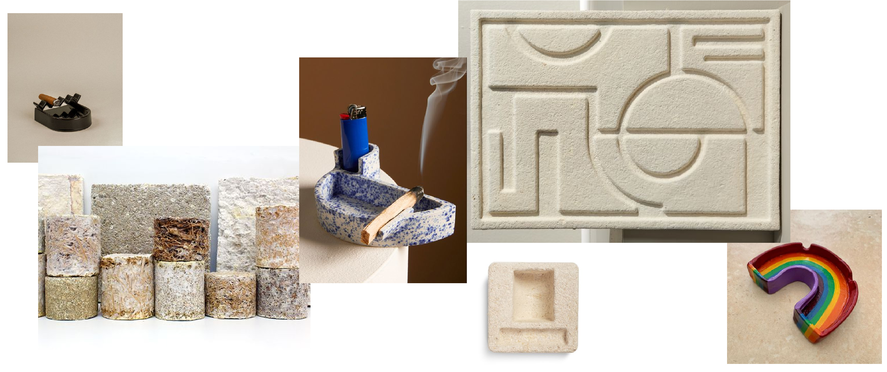

# **Digital Prototyping for Design**

## Module 1
> 2D Fabrication

> Santiago Fuentemilla Garriga & Josep Martí

> 17-16 January 2024

### **Task: Fabricate a small prototype with the lasercutter, by designing a lasercut mold for bioplastics.**
_by Carmen & Núria_

**1.References**

**2.Pictures of the process**

<iframe width="560" height="315" src="https://www.youtube.com/embed/0cLL_Nu7nfY?si=LmL6-BlNchwVKKeV" title="YouTube video player" frameborder="0" allow="accelerometer; autoplay; clipboard-write; encrypted-media; gyroscope; picture-in-picture; web-share" allowfullscreen></iframe>

**3.Fabriaction files**

<iframe src="https://drive.google.com/file/d/1WV4SkuWN3EyMLOiyFW_jjc6nAjSrjmyT/preview" width="640" height="250" allow="autoplay"></iframe>

**4.Reflection: The four F’s of active reviewing**

Facts:

- We had to make two iterations of the gelatin-based biomaterial because we did not put Glycerol in the first recipe. This caused the material, when it dried, to deform upwards and become very stiff, which we were not interested in.

- In the second iteration, we added Glycerol to the mixture and covered the material while it was drying, to avoid the previous deformations. Since we used an unsterilized surface to cover the material, moisture and dirt accumulated and when we returned from the weekend, organisms had grown.

- We had to use the double of acrylic material in order to make a mold, the trimmed part of the mold, and the base so that the biomaterial would not fall off.

Feelings:

- We felt a little silly making two mistakes with such a simple biomaterial recipe. Yet we were motivated to make it work.

- Regarding the acrylic material, we feel bad about using more material than we should have.

Findings:

- If we had done small trials of the biomaterial, before the final one, we would not have made these mistakes.

- When using biomaterials it is difficult to control the time, and you have to be at the mercy of the material.

- You have to think about the manufacturing process and the material to be used beforehand.
 
Future:

- I will think before I go straight to making, I will make a plan and list of materials to keep in mind.
 

---
## Module 2
> Additive Fabrication

> Santiago Fuentemilla Garriga & Josep Martí

> 31-1 January 2024

### **Task: Design and 3D print a mould to grow your own materials (Mycelium).**
_by Carmen & Núria_

**1.References**

**2.Pictures of the process**

**3.Fabriaction files**

We decided to use an open source model that really fit into our project. It's a mold for cement but we made some alteration to make it for mycelium.

{ width="350" } 

[You can find the file here](https://cults3d.com/en/3d-model/home/drop-ashtray)

**4.Reflection: The four F’s of active reviewing**

Facts:

- The main idea we had (mixing mycelium with tobacco ashes) could not be completed due to timing problems.

- The 3D printer in our class was not ready to print directly and we had trouble starting the print. After calibrating it, cleaning the bed well and applying some spray we got it done.

Feelings:

- Satisfaction that, almost, everything went right first time.

- Nerves and expectations as the mycelium grew.

- Fear that we had not sterilized the recipe sufficiently.

Findings:

- With materials that grow you have to be very patient, and plan the experiment well to be able to develop it as you want.

 
Future:

- In the future, I would like to create more than one mold simultaneously to be able to experiment with different shapes at the same time.

---
## Module 3
> CNC manufacturing - Scaling manufacturing in distributed world

> Santiago Fuentemilla Garriga & Josep Martí

> 21-22 February 2024

### **Task: Fabricate (in pairs) ONE piece of furniture for your classroom**
_by Carmen, Oliver & Núria_

**1.References**

**2.Pictures of the process**

{ width="150" } 
{ width="150" } 
{ width="150" }
{ width="150" }
{ width="150" }
{ width="300" }    

**3.Fabriaction files**

You can find the fabrication files in the following link: https://drive.google.com/drive/folders/1NmSh28hcguX5nGBE1HpGVCuo5WYQRLI6?usp=sharing

The files are sorted by:

- Design 1 (The box design)
    - CNC files
    - Design Rhino
- Design 2 (The shelving design)
    - CNC files
    - Design Rhino
- Final design
    - CNC files
    - Design Rhino
    - GCODE

