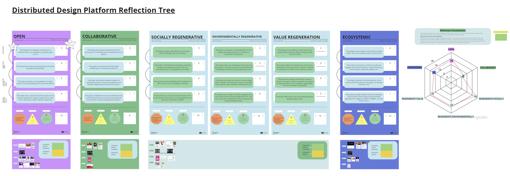

# Second Term Final Delivery

## Future Talks
> Design with Values

> Sally Bourdon & Olga Trevisanç

> 16th January 2024

### Contents & Reflection

For the first session of the Future Talks, about Designing with Values, Sally and Olga presented us the project of Distributed Design and a tool they have developed to help designers evaluate their own projects and practices. As part of the seminar, we undertook the evaluation with this tool, the Reflection Tree. We had to evaluate either a past project we had done, our general creative practice in the past and in the present or a possible future project.

In my case I choose to think about a mix between my values as a designer and the possible future master thesis I will make while doing the Reflection Tree. This was the result.

You can read the text and find out more about my reflection tree [**here**](https://miro.com/app/board/uXjVN8fPjco=/)

The **key take aways** of this activity for me are two.

1. Distributed Design: getting to know design projects that also resonate with the values and topics we treat in our everyday life in MDEF is very important for me to be able to exemplify in "the real world" what normally only happens inside our class. It was very interesting to hear about the project and see how it works and what impact it has.

2. Self-evaluation: the act of reflecting on oneself has always caught my attention. In this case, for the first time, I evaluated my future self, someone that doesn't yet exist. It was more difficult to do than normally, but at the same time it gave me a lot of motivation to start building that future self and her projects.

As a **general reflection** on the tool Reflection-Tree I would say it's a very good tool, very well thought and that makes you think while you use it. There are some parts that we don't normally consider in certain projects, for example materials in a more "social" design project. I think it's important to have a holistic view of how we work as designers and what values do we apply. The only thing I would suggest is maybe a bit of personalization possibility within the tool. These kinds of exercises, if applied to multiple people and projects, are very subjective, and maybe someone fins the tool a bit robust and static. Other than that, I really enjoyed the talk and the exercise :)

---
## Design Space

<iframe width="768" height="432" src="https://miro.com/app/live-embed/uXjVNL418H8=/?moveToViewport=13031,-6708,6054,3216&embedId=134336009842" frameborder="0" scrolling="no" allow="fullscreen; clipboard-read; clipboard-write" allowfullscreen></iframe>

---

## Video

<iframe src="https://drive.google.com/file/d/1wKCVz6JIJKTPrviNpQf7fCPlH5U2J9Oo/preview" width="640" height="480" allow="autoplay"></iframe>

